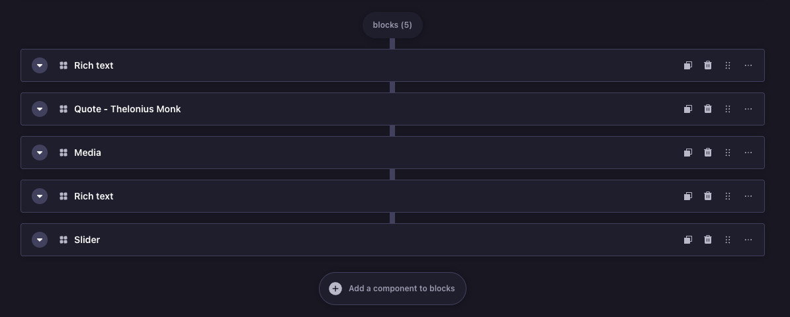

# strapi-dz-component-duplicator

A Strapi 5 admin plugin that adds a **Duplicate** button to every dynamic zone block in the Content Manager edit view, so editors can clone a block in one click and then tweak only what changes.

## What it does

In content types that use [dynamic zones](https://docs.strapi.io/dev-docs/backend-customization/models#dynamic-zones), each block (e.g. a "Quote", "Image", or "CTA" component) gets an action row with delete, drag, and more actions. This plugin injects a **Duplicate** action in that same row.

- **One-click clone** — Duplicate creates a full copy of the block (including nested components and media references) and inserts it right after the current block.
- **Clean copy** — Transient fields like `id`, `documentId`, and `__temp_key__` are stripped so Strapi treats the duplicate as a new entry.
- **No extra steps** — Works in the existing edit view; no new screens or modals.

Useful when you have several similar blocks (e.g. multiple testimonials or CTAs): duplicate once, then change only the differing fields instead of re-adding the component and re-entering everything.




## Install

```bash
npm install strapi-dz-component-duplicator
# or
pnpm add strapi-dz-component-duplicator
# or
yarn add strapi-dz-component-duplicator
```

Enable in `config/plugins.ts`:

```ts
export default () => ({
  'strapi-dz-component-duplicator': {
    enabled: true,
  },
});
```

Then rebuild admin:

```bash
npm run build
# or
npm run develop
```

The Duplicate button only appears on edit views for content types that have at least one dynamic zone field. If you don’t see it, confirm the plugin is enabled, the admin was rebuilt after installing, and you’re editing an entry whose content type uses a dynamic zone.

## Compatibility

- Strapi: `^5.0.0`
- Node: `>=20.0.0 <=24.x.x`
